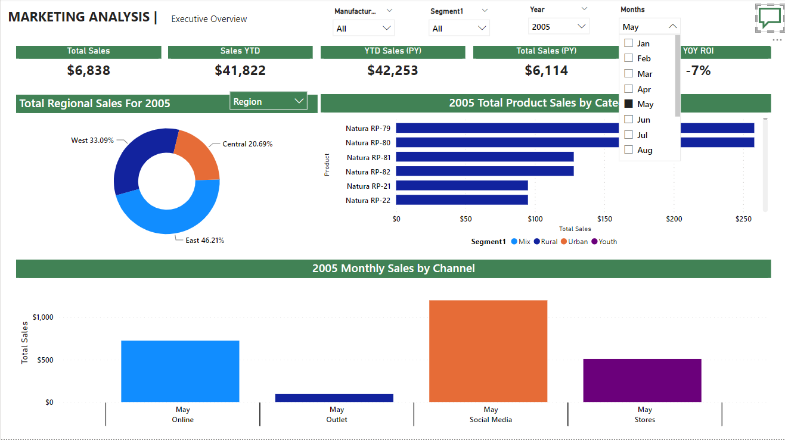

# Analyzing Motion International's marketing performance, spotlighting geographical, manufacturers, products, marketing channels and, sales dynamics using Power BI.

Link to my interactive dashboard 👉 [here](https://app.powerbi.com/links/4eS1xHtH-E?ctid=5aed691c-fa14-4f28-8380-fbd6b5058693&pbi_source=linkShare&bookmarkGuid=a28d15cc-3f58-4643-be5c-eb3e7198ee03) or [here](https://app.powerbi.com/view?r=eyJrIjoiZDZjYjAzZWQtNWJmMi00NWEwLThmNzEtMTZjOTA1NTcyNGU3IiwidCI6IjVhZWQ2OTFjLWZhMTQtNGYyOC04MzgwLWZiZDZiNTA1ODY5MyJ9)

## Introduction:
Welcome to my capstone project. It promises to be an exciting navigation through a dynamic world of data insights! My Power BI capstone project aims to unearth marketing trends by diving deep into the realm of data analysis. This project meticulously probes data across different geographical locations, manufacturers, product categories, and marketing channels. It empowers stakeholders with decision-making power for business growth as they uncover the trends, identify correlations, and explore the narrative that unfolds within the compelling visualizations.

I sought insights into multi-dimensional marketing analysis and how it affects profitability and performance over the years. Leveraging Power BI, this project gathered reporting requirements and offered actionable insights for informed business decisions.

## Highlighted Proficiencies and Competencies:
* Data Modeling: Created effective data models to support business requirements and enable insightful analysis.

* DAX (Data Analysis Expressions): Utilized DAX functions for complex calculations, aggregations, and creating custom measures.

* Data Visualization: Skillfully designed visually appealing and intuitive dashboards and reports for effective data communication.

* Query Editor: Demonstrated proficiency in data transformation and cleansing using Power BI's Query Editor to ensure data accuracy and reliability.

* Power Query: Extracted, transformed, and loaded data from various sources into Power BI for comprehensive analysis.

* Advanced Analytics: Leveraged Power BI's advanced analytical features, for example, forecasting and trend analysis, for deeper insights.

* Report Interactivity: Designed and created interactive reports with slicers, drill-throughs, and bookmarks for a user-friendly experience.

* Power BI Service: Deployed and shared reports on Power BI Service, including setting up dashboards and managing access.

* Power BI Gateway: Configured and managed Power BI Gateway for secure and seamless data connectivity.

* Data Governance: Understanding of data governance principles within Power BI, ensuring data security, compliance, and quality.

## Data Modelling:
* Relationships: Established relationships between tables based on common fields and ensured that relationships are correctly defined to support accurate analysis. Additionally, automatically derived relationships were adjusted to remove and replace unwanted relationships.

* Modeling: Defined the structure of the data model by creating calculated columns, measures, and tables: utilizing DAX (Data Analysis Expressions) for custom calculations.

* Hierarchies: Created hierarchies to enable drill-downs and better navigation through data. Defined logical groupings for dimensions

* Schema: The star schema model was deployed to provide enhanced query performance and simplify data navigation. I organized data into a central fact table connected to dimension tables, facilitating efficient analysis and reporting. 

## Dynamic Data Analysis Expressions (DAX Measures):

* ### Field Parameter:

      Parameter = {
        ("Channel", NAMEOF('Channel and Products'[Channel]), 0),
        ("Region", NAMEOF('Geographical Locations'[Region]), 1)
      }
* ### Yearly Region and Channel Sales Title:
 
            Channel and Regional Sales Title = 
        SWITCH(TRUE(),
        SELECTEDVALUE('Parameter 2'[Parameter Order]) = 0, 
            "Total Channel Sales For " & 
            SELECTEDVALUE('Date 3'[Year],  "All Years"),
            "Total Regional Sales For " & 
            SELECTEDVALUE('Date 3'[Year],  "All Years")
        )

* ### Total Sales Year to Date:
   
          Total Sales YTD = TOTALYTD(SUM('Motion Sales'[Units]), 'Date 3'[Date])
* ### Colour coding for the ROI Title:

        Colour ROI = 
      SWITCH(TRUE(),
      [YOY ROI 2] < 0, "Red",
      [YOY ROI 2] > 0, "Green",
      "Black"
      )
* ### Total Sales Year to Date for the Past Year:

      Total Sales YTD (PY) = CALCULATE(
        [Total Sales YTD],
        DATEADD('Date 3'[Date], -1, YEAR))
* ### Year over Year Return on Investment:

        YOY ROI 2 = 
      DIVIDE([Total Sales YTD] - [Total Sales YTD (PY)], [Total Sales (PY)], 0)
* ### Yearly Product Sales by Category Title:

        Product Sales Title = 
      SELECTEDVALUE('Date 3'[Year], "-") & 
      " Total Product Sales by Category"
* ### Monthly Sales by Channel Title:

        Monthly Sales Title = 
      SELECTEDVALUE('Date 3'[Year], "-") & 
      " Monthly Sales by Channel "
* ### Return on Investment Title:

      ROI TITLE = 
            FORMAT([YOY ROI 2], "0%") & 
            " ROI (Return on Investment)"
* ### Yearly ROI and Sales Title:

      ROI and Sales Title = 
      SELECTEDVALUE('Date 3'[Year], "All Years") & 
      " Monthly Sales and ROI"
* ### Percentage Total Sales Year to Date Difference:

      Total Sales YTD Diff % = DIVIDE([Total Sales YTD] - [Total Sales YTD (PY)], [Total Sales YTD (PY)], 0)
* ### Total VanArsdel Sales:

      Total VanArsdel Sales = CALCULATE([Total Sales], Products[Manufacturer] = "VanArsdel")
* ### Percentage VanArsdel Market Share:

      Percentage VanArsdel Market Share = DIVIDE([Total VanArsdel Sales], [Total Sales])
* ### Total State Sales:

      Total State Sales = 
      SUMX(
          VALUES('Geographical Locations'[State]),
          CALCULATE(
              SUM('Motion Sales'[Units]
          )
      )
      )

* ### Business Questions:
1. Q/A Overview:

2. Insights into the top geographical state locations by revenue generated:

3. Insights into the top geographical state locations by previous year's revenue:

4. Insights into the total VanArsdel sales by state locations:

5. Insights into the top performing districts by VanArsdel sales:

6. Insights into the top prduct categories by total sales for the past year:

7. 

## VISUALIZATIONS:
